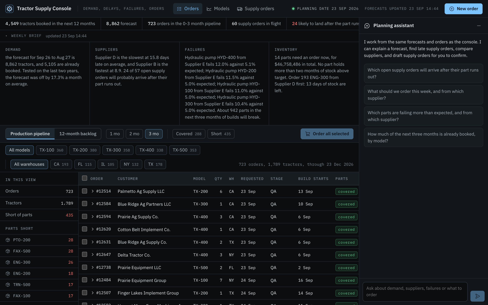
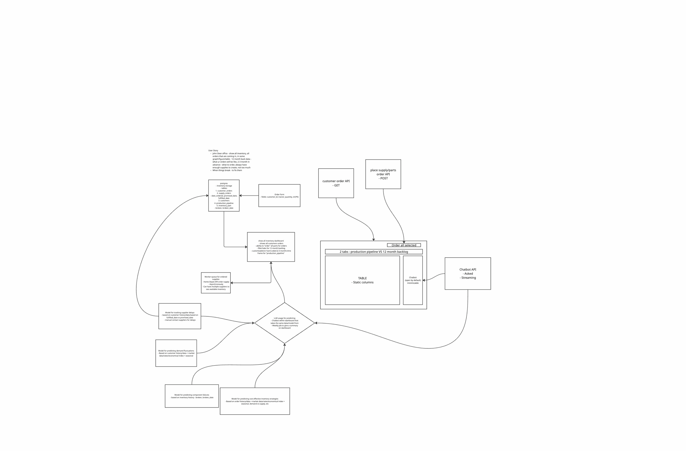
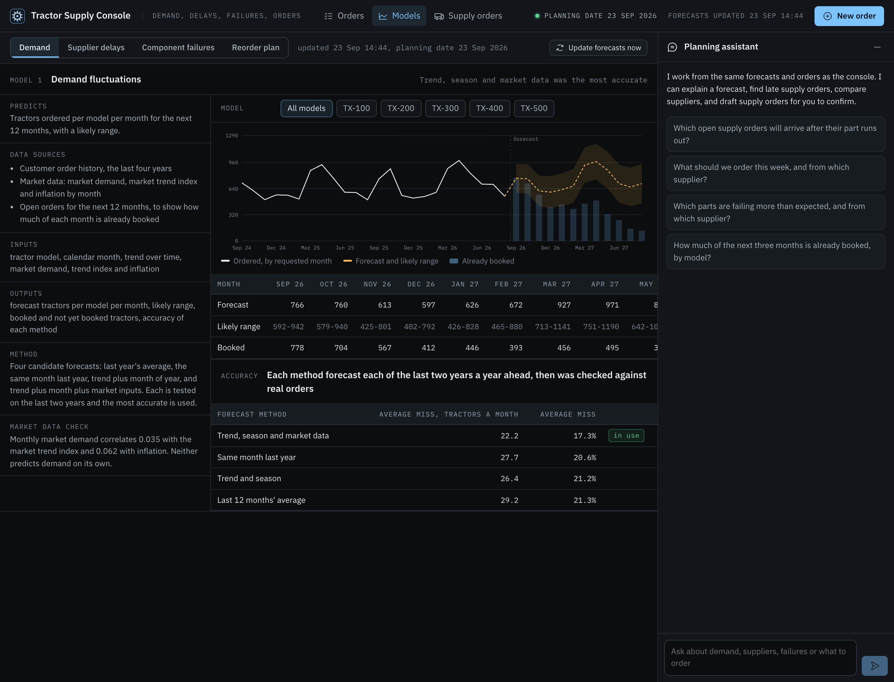
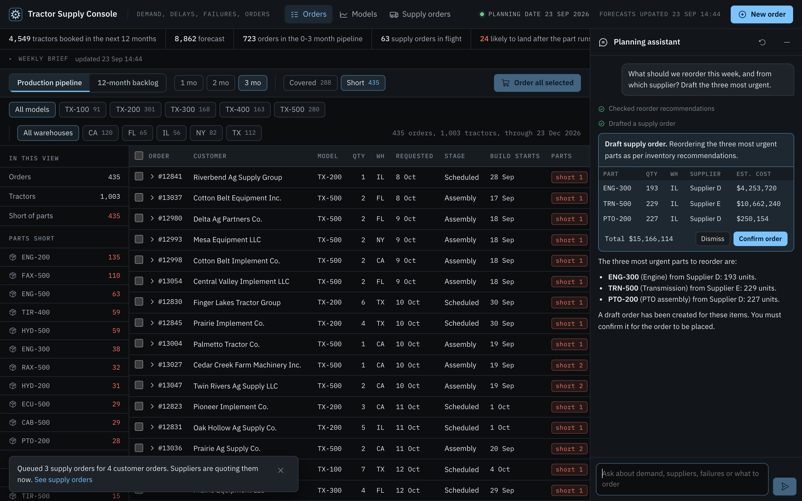
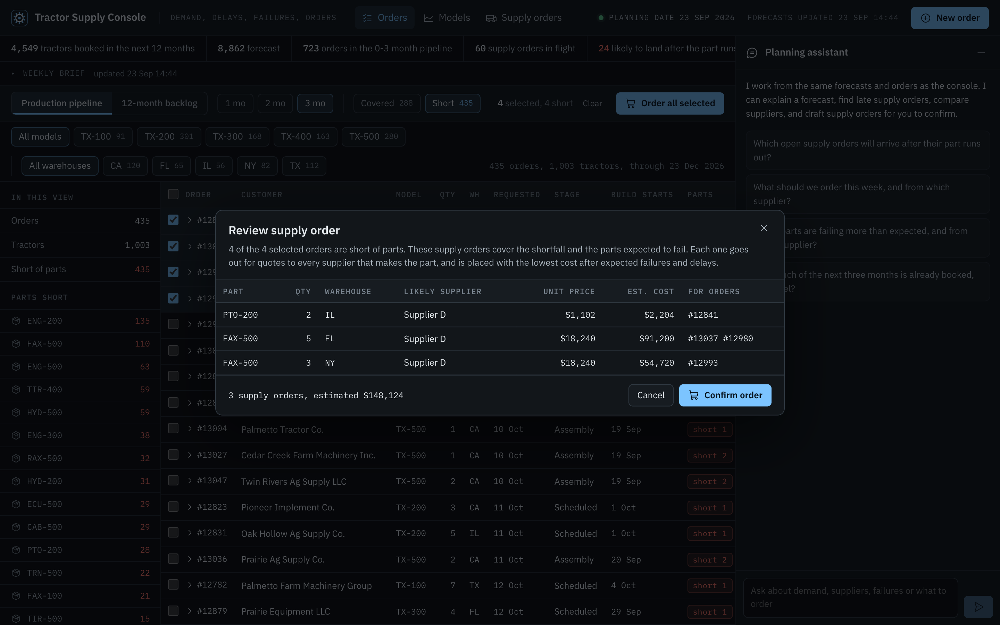
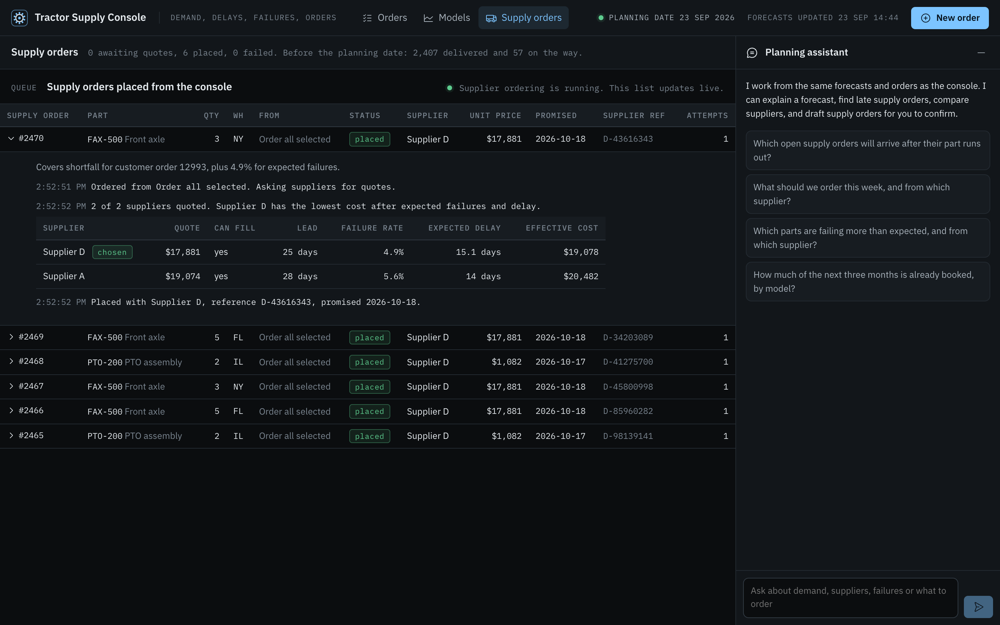

# Tractor Supply Console

A working prototype of the supply chain application designed in the Kontakt.io system design interview. It predicts demand, supplier delays and component failures for a tractor manufacturer, recommends what to reorder and from whom, and places supply orders through a queue. A planning assistant answers questions and drafts orders from the same data.



**Demo video (under a minute):** it walks through the orders pipeline, ordering parts for selected orders, the weekly brief, the planning assistant drafting an order, each model, the supply order queue and recording a new order.

[](https://youtu.be/hRGQxR8rd-8)

## Run it locally

You need Node 20 or newer and Docker.

```bash
git clone https://github.com/kyisaiah47/tractor-supply-console.git
cd tractor-supply-console
cp .env.example .env
npm install
npm run db:up        # Postgres 16 in Docker, on port 5433
npm run db:setup     # generates the dataset, loads it, runs the four models
npm run dev          # the app on http://localhost:3000 and the supply order worker
```

Open http://localhost:3000.

The planning assistant works without an API key. With no key it answers by keyword from the same tools. For full answers, set one key in `.env`:

| Provider | Setting | Notes |
|---|---|---|
| Google Gemini | `GEMINI_API_KEY` | Free tier at https://aistudio.google.com/apikey. Default model `gemini-flash-latest`. The free tier allows about 20 requests per model per day, and each question takes two or three. On a 429 the app moves to the next model in `GEMINI_FALLBACK_MODELS`. When every model is out, the assistant answers in keyword mode and says so. |
| Anthropic Claude | `ANTHROPIC_API_KEY` | Default model `claude-opus-5`. |

`LLM_PROVIDER` forces one of `gemini`, `anthropic` or `offline`.

Other commands:

| Command | What it does |
|---|---|
| `npm test` | Model and unit tests against the seeded database |
| `npm run job:weekly` | Runs the weekly job: all four models, then the weekly brief |
| `npm run worker` | Runs the supply order worker on its own (`npm run dev` already starts it) |
| `npm run data:generate` | Rebuilds `data/generated/` from the provided CSV |
| `npm run db:down` | Stops Postgres |

## From the whiteboard to the code

The design from the interview is in [docs/system-design-whiteboard.pdf](docs/system-design-whiteboard.pdf).



| Whiteboard box | Where it lives |
|---|---|
| User story: see all inventory and incoming orders, 12 months back, order 2-3 months ahead, fix things that break | The Orders page and the Models page |
| Postgres: customer_orders, supply_orders, customers, production_pipeline, inventory_part | [db/schema.sql](db/schema.sql). `inventory_parts` holds received lots with `broken_quantity`, `broken_date` and where the failure was found. |
| Order form: customer_id, tractor, quantity, id | The New order modal and `POST /api/orders` |
| Customer order API, GET | `GET /api/orders` |
| Place supply/parts order API, POST | `POST /api/supply-orders` |
| Dashboard: 2 tabs, production pipeline vs 12-month backlog, static table, Order all selected | The Orders page. Order all selected opens a review, and nothing is ordered until you confirm. |
| Chatbot, open by default, minimizable, streaming | The planning assistant panel and `POST /api/chat` |
| Worker queue for ordered supplies, supplier API, asynchronous, several suppliers | `supply_jobs` in Postgres and [scripts/worker.ts](scripts/worker.ts). Mock supplier APIs are under `/api/mock-suppliers/:supplier`. |
| Model for supplier delays | [src/lib/models/supplierDelay.ts](src/lib/models/supplierDelay.ts) |
| Model for demand fluctuations | [src/lib/models/demand.ts](src/lib/models/demand.ts) |
| Model for component failures | [src/lib/models/componentFailure.ts](src/lib/models/componentFailure.ts) |
| Model for cost-effective inventory strategy | [src/lib/models/inventoryStrategy.ts](src/lib/models/inventoryStrategy.ts) |
| LLM: chatbot on the same data, weekly job writes a summary on the dashboard | [src/lib/agent/](src/lib/agent/) and [src/lib/weekly.ts](src/lib/weekly.ts) |

## The data

### The provided dataset

[data/market_signals.csv](data/market_signals.csv) is the dataset Kontakt.io provided: 10,000 rows from 2020-01-01 to 2023-12-30. Each row has a date, tractor model (TX-100 to TX-500), demand units, supplier (Supplier A to E), supplier delay days, component failure rate, inventory level, warehouse (CA, FL, IL, NY, TX), inflation rate and market trend index.

I measured it before building anything:

- Demand does not correlate with the market trend index (r = 0.001) or with inflation (r = 0.013).
- Average demand is flat across calendar months, between 269 and 278 units.
- All five suppliers average between 14.5 and 14.8 days of delay.
- All five tractor models average a failure rate between 4.9% and 5.1%.

So the dataset on its own has no signal to predict, and a model that claimed a strong result from it would be fitting noise. Every model here is tested against a simple baseline on data it did not see.

### The generated operational data

The whiteboard's tables do not exist in the provided dataset, so [scripts/generate-data.ts](scripts/generate-data.ts) builds them from it. The generator is seeded, so the same planning date always gives the same data. Its output is in [data/generated/](data/generated/).

| Table | Rows | Built from the provided dataset by |
|---|---|---|
| customers | 64 | Dealers, fleets and co-ops in the five warehouse states |
| customer_orders | about 14,500 | 1% of each model's monthly market demand, shaped by a planting-season cycle and 6% yearly growth |
| production_pipeline | about 720 | Open orders due in the next three months, with build dates |
| parts, part_suppliers | 50, 125 | Ten parts per model. Each part is made by two or three of the dataset's suppliers. |
| supply_orders | about 2,450 | Monthly part orders. Each delay is sampled from that supplier's own delays in the dataset. |
| inventory_parts | about 2,400 | One received lot per supply order. Broken counts come from the dataset's failure rate for that model and month. |
| inventory | 250 | The dataset's latest inventory level per model and warehouse, scaled to our share |

### The app runs on today's date

The dataset ends in 2023. The generator moves every dataset date forward by the same number of days, so the last row becomes yesterday. Orders before today are history. Orders from today on are the open order book. The CSV is never changed, and `market_signals.source_date` keeps each row's original date. Set `APP_AS_OF=YYYY-MM-DD` and run `npm run db:setup` again to use another day.

### Planted effects

Four effects are written into the generated data on purpose ([src/lib/planted.ts](src/lib/planted.ts)), so the models have real signal to find:

1. Orders peak in March to May for planting, with a smaller September bump.
2. Supplier B delivers 40% faster than its dataset delays. Supplier D is 40% slower in Q4.
3. Hydraulic pumps from Supplier E fail 2.5 times as often.
4. TX-400 transmissions fail 1.8 times as often, from every supplier.

The tests check that the models find all four, and that they do not flag parts that were not planted.

## The four models

Every model is scored on data it did not see, against a simple baseline. The figures below come from a run with planning date 23 Sep 2026. They change slightly with the planning date.

### 1. Demand fluctuations

- **Predicts:** tractors ordered per model per month for the next 12 months, with a likely range.
- **Data sources:** customer order history, the market data's demand, trend index and inflation, and the open order book.
- **Inputs:** tractor model, calendar month, trend over time, market inputs.
- **Outputs:** forecast per model per month, an 80% range, booked and not yet booked tractors.
- **Method:** four candidate forecasts are each run a year ahead for each of the last two years. The most accurate one is used.

| Method | Average miss |
|---|---|
| Trend, season and market data (used) | 17.3% |
| Same month last year | 20.6% |
| Trend and season | 21.2% |
| Last 12 months' average | 21.3% |

Market inputs for future months are unknown, so the backtest holds them at their trailing 12-month average, the same as the live forecast does.

### 2. Supplier delays

- **Predicts:** how many days late each supplier delivers by quarter, and the chance each open supply order arrives after its part runs out.
- **Data sources:** promised and delivered dates on past supply orders, the dataset's supplier delays as a baseline, and stock with the production schedule for the date each part runs out.
- **Method:** the average delay per supplier and quarter, pulled toward the supplier's overall average when a quarter has few orders. The chance of being late comes from each supplier's real spread of delays.
- **Result:** on 578 supply orders from the last year, the model misses by 7.27 days on average. The overall average misses by 7.69 days, and the dataset's per-supplier average misses by 7.74.
- It finds Supplier B at 8.9 days late (the dataset says 14.7) and Supplier D at 18.7 days in Q4 (14.3 to 15.3 in other quarters).

### 3. Component failures

- **Predicts:** the failure rate of every part from every supplier, and how many parts in the next three months of builds will break.
- **Data sources:** received lots with broken counts and where the failure was found, and the dataset's failure rate per model as the starting point.
- **Method:** each rate starts at the dataset's rate and moves toward the supplier's own record as parts are received (a beta-binomial model with the dataset rate as the prior). A part is flagged when even the low end of its range is 25% above the dataset rate. Lots received in the last 120 days are left out because they have not had time to fail.
- **Result:** on 115 part and supplier pairs from the last year, the model misses by 4.69 broken parts per pair. The dataset rate misses by 5.27.
- It flags all five Supplier E hydraulic pumps (9.4% to 12.0% against about 5%) and the TX-400 transmissions (7.6% to 8.8%). It flags nothing else.

### 4. Cost-effective inventory strategy

- **Predicts:** for every part, whether to order now, how many, and from which supplier.
- **Data sources:** the other three models, stock on hand and on order, supplier prices and lead times, and the dataset's inflation.
- **Method:** a reorder-point policy at a 95% service level. Lead time is the supplier's quoted lead time plus its expected delay, and the delay spread counts as lead-time risk. Quantities are raised to cover expected failures. The supplier is the cheapest after pricing in its failures and delays. Holding cost is 20% of the price per year plus inflation.
- **Result:** it never picks Supplier E for hydraulic pumps. Every order it recommends brings stock back above the reorder point.



## The planning assistant

The assistant is an agent with nine tools. Each tool reads the same model output and tables as the screens, so the assistant and the console always show the same numbers.

| Tool | Reads |
|---|---|
| get_overview | Headline counts |
| list_customer_orders | The Orders table, with part shortfalls |
| get_demand_forecast | The demand model |
| get_supplier_delays | The supplier delay model and at-risk supply orders |
| get_component_failures | The component failure model |
| get_inventory_recommendations | The reorder plan |
| query_market_signals | Aggregates over the provided dataset |
| get_weekly_brief | The latest weekly brief |
| propose_supply_order | Drafts supply orders. It writes nothing. |

The assistant can only draft orders. The chat shows the draft with a Confirm button, and nothing is ordered until a person presses it. The answer streams to the browser as newline-delimited JSON events, so the chat shows each tool call as it happens. Both Claude (Anthropic SDK, with server-side fallbacks) and Gemini (OpenAI-compatible endpoint) run the same tool loop.



## Ordering parts

Three places create supply orders: Order all selected on the Orders page, Queue selected on the reorder plan, and Confirm on an assistant draft. Each one writes the order as `queued` with a job in `supply_jobs`.

The worker claims jobs with `FOR UPDATE SKIP LOCKED`, so several workers can run at once. For each job it gets a quote from every supplier that makes the part, scores the quotes on price adjusted for that supplier's failure rate and expected delay, and places the order with the lowest. It records every step in the job's log. About 1 in 12 mock supplier calls returns a 503, and the worker retries with exponential backoff up to five times.





## API

All bodies are JSON and validated with zod. A bad request returns 400 with the issues.

| Method | Path | What it does |
|---|---|---|
| GET | `/api/orders` | Customer orders with part allocation and filter counts. Query params: tab (pipeline or backlog), months, model, warehouse, parts (covered or short). |
| POST | `/api/orders` | Records a customer order: `customerId, tractorModel, quantity, requestedDate`, optional `warehouse` |
| GET | `/api/customers` | Customers for the order form |
| POST | `/api/supply-orders` | Queues supply order lines, or covers the part shortfalls of a set of customer orders. See the curl examples below for both request shapes. |
| GET | `/api/supply-orders` | Supply orders with their job and log. Query params: status, source. |
| POST | `/api/chat` | The assistant. Streams `meta, text, tool_call, tool_result, done` and `error` events. |
| GET | `/api/models` | The latest output of all four models, with their sources, inputs and outputs |
| GET | `/api/models/:name` | One model: `demand, supplier_delay, component_failure or inventory_strategy` |
| POST | `/api/jobs/weekly` | Runs the weekly job |
| GET | `/api/brief` | The latest weekly brief |
| GET | `/api/overview` | Headline counts |
| GET | `/api/queue` | Worker heartbeats and recent jobs |
| GET | `/api/mock-suppliers/:supplier/quote` | A supplier's price, stock and lead time. Query params: sku, qty. |
| POST | `/api/mock-suppliers/:supplier/orders` | Places an order with a supplier |

Examples:

```bash
curl 'localhost:3000/api/orders?tab=pipeline&months=1&parts=short&limit=2'

curl -X POST localhost:3000/api/supply-orders -H 'content-type: application/json' \
  -d '{"lines":[{"sku":"HYD-400","quantity":120}]}'

curl -X POST localhost:3000/api/supply-orders -H 'content-type: application/json' \
  -d '{"customerOrderIds":[12539,12550],"dryRun":true}'

curl -N -X POST localhost:3000/api/chat -H 'content-type: application/json' \
  -d '{"messages":[{"role":"user","content":"Which supplier is slowest in Q4?"}]}'
```

## Project layout

```
db/schema.sql                 Postgres schema
data/market_signals.csv       the provided dataset
data/generated/               the generated operational data
scripts/                      generator, seed, weekly job, supply order worker
src/lib/models/               the four models
src/lib/agent/                the assistant: tools, tool loop, offline mode
src/lib/allocation.ts         allocates stock and inbound supply to open orders
src/app/                      pages and API routes (Next.js 16 App Router)
src/components/               the console UI
tests/                        model and unit tests
```

## Tests

`npm test` runs 13 tests. Nine run against the seeded database and check that each model beats its baseline and finds each planted effect. Four are unit tests for the statistics and the stock-out calculation. CI runs lint, typecheck, the seed, the tests and a production build on every push.

## What I would do next in production

- Replace the mock supplier APIs with real supplier integrations, and add idempotency keys to supply order placement.
- Run the weekly job on a scheduler and keep every model run, so forecast accuracy can be tracked over time.
- Add sign-in and roles, so only planners can confirm supply orders.
- Retrain the failure model on field warranty claims as well as receiving and assembly data.
